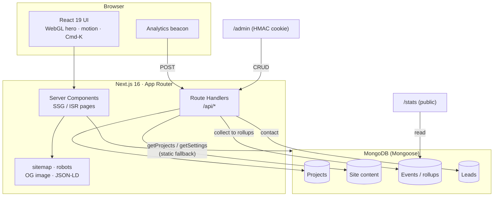
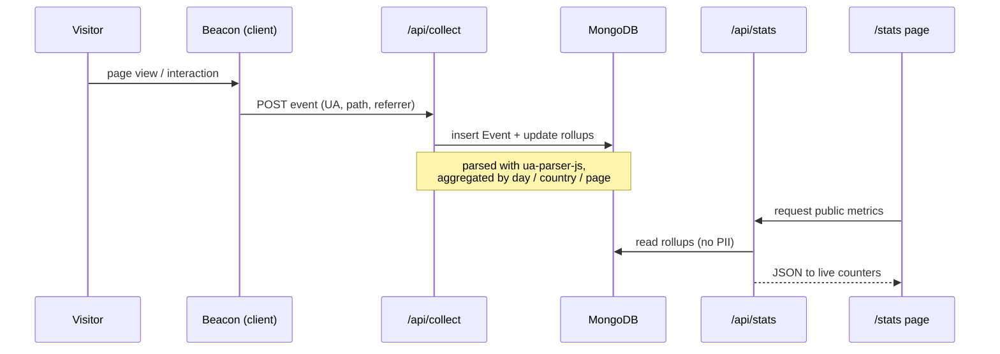

<!-- ========================= HEADER ========================= -->
<div align="center">


<br/>

<a href="https://readme-typing-svg.demolab.com">
  
</a>

<br/><br/>

<!-- Live + badges -->
<a href="https://shivam-bhadoriya-dev.vercel.app"></a>
&nbsp;
<a href="https://github.com/Dev-Shivam-05"></a>
&nbsp;
<a href="https://linkedin.com/in/shivam-bhadoriya-dev"></a>

<br/><br/>


</div>

<!-- ========================= INTRO ========================= -->
<br/>

> **Most portfolios claim engineering skill and show only screenshots. This one proves it — live.**
> A cinematic Next.js front end over a real MongoDB backend, a self‑built analytics pipeline, and an env‑gated admin CMS. Every number on the site is measurable, and every claim is inspectable.

<div align="center">
  <sub>⚡ Real‑world <b>LCP ≈ 1.2&nbsp;s</b> mobile / <b>0.84&nbsp;s</b> desktop &nbsp;·&nbsp; 🎯 <b>SEO 100</b> &nbsp;·&nbsp; 🧱 <b>CLS 0</b> &nbsp;·&nbsp; ♿ <b>A11y 96</b></sub>
</div>

<br/>


## ✨ What's inside

<table>
<tr>
<td width="50%" valign="top">

**🎬 Cinematic, engineered UI**
- WebGL shader hero (React Three Fiber) with a zero‑GPU CSS "liquid" fallback for phones & reduced‑motion
- A **signature that draws itself stroke‑by‑stroke on scroll** — a real SVG font path, scrubbed by scroll position
- Lando‑style brand cold‑open (`LOAD SHIVAM`), magnetic buttons, Lenis smooth scroll, `⌘K` command palette
- Full dark / light, reduced‑motion aware, keyboard navigable

</td>
<td width="50%" valign="top">

**🧠 A real backend — not a static site**
- MongoDB + Mongoose models (projects, content, media, leads, events)
- Self‑built analytics pipeline: `beacon → API → rollups` feeding a **public `/stats` page**
- **Env‑gated admin CMS**: edit copy, CRUD projects, upload media, view a leads pipeline — HMAC‑cookie auth
- One‑command **seed script**; runs on typed static fallback with **no DB at all**

</td>
</tr>
<tr>
<td width="50%" valign="top">

**⚡ Fast on purpose**
- Above‑the‑fold hero paints via **CSS, not JS** — LCP never waits on hydration
- Tree‑shaken bundle (981 KB → ~250 KB transfer)
- Scroll reveals on **IntersectionObserver + CSS**, not per‑element JS
- Fully CSS‑driven preloader that never blocks the critical path

</td>
<td width="50%" valign="top">

**🎯 SEO‑first, multi‑page**
- `Person` / `WebSite` / `ProfilePage` JSON‑LD → eligible for a knowledge panel
- **Image‑enabled sitemap**, tuned `robots`, dynamic Open Graph images
- Canonical URLs, per‑page metadata, semantic headings
- 8 indexable routes incl. project case studies + live stats

</td>
</tr>
</table>


## 🧩 Tech stack

<div align="center">


</div>

| Layer | Tools |
|-------|-------|
| **Framework** | Next.js 16 (App Router · Turbopack) · React 19 · TypeScript 5 |
| **Styling** | Tailwind CSS v4 (CSS‑first `@theme` tokens) · custom design system |
| **Motion / 3D** | Motion · Lenis smooth scroll · React Three Fiber + three.js (desktop‑only WebGL) |
| **Backend** | Next Route Handlers · MongoDB · Mongoose · Zod validation |
| **Auth** | HMAC‑signed cookie admin session |
| **Data viz** | Recharts (admin dashboards) · hand‑rolled SVG on the public side |
| **Email** | Nodemailer (contact form, optional) |
| **Quality** | ESLint · Lighthouse · Playwright |


## 🏗️ Architecture

A Next.js App Router front end (RSC + client islands) talking to route handlers, backed by MongoDB — with the site's **own** analytics instead of a third‑party script.



<details>
<summary><b>📡 The analytics pipeline (beacon → API → rollups → public stats)</b></summary>

<br/>



Every visit is measured by code Shivam wrote — the same numbers surfaced on the public stats page and the private admin dashboard.

</details>


## 🎨 How it was built — engineering decisions

<details open>
<summary><b>Performance is a feature, not a pass</b></summary>

<br/>

- **The hero paints without JavaScript.** The headline and body animate via CSS keyframes, so the Largest Contentful Paint fires on first paint instead of waiting for React to hydrate — this alone cut mobile LCP from **9.5 s → ~1.2 s**.
- **The preloader is 100% CSS.** The `LOAD SHIVAM` cold‑open wipes on a fixed CSS timeline, so it never sits on the critical path or gates the LCP on hydration.
- **Reveals moved off the main thread.** A shared `IntersectionObserver` + CSS classes replaced dozens of per‑element motion instances, dropping main‑thread blocking (desktop 94 ms → ~55 ms).
- **The bundle was tree‑shaken** via `optimizePackageImports`, taking first‑load JS from **981 KB → ~250 KB** transferred.

</details>

<details>
<summary><b>Motion & 3D that respect the device</b></summary>

<br/>

- WebGL (three.js) is **dynamically imported and desktop‑only**; phones and reduced‑motion users get a GPU‑free CSS "liquid" gradient that reads the same.
- The signature is generated from a real font outline (opentype.js → SVG path) and **scrubbed by scroll** — `strokeDashoffset` is driven by the element's live viewport position each frame, so it stays correct under Lenis smooth‑scroll.

</details>

<details>
<summary><b>A backend worth inspecting</b></summary>

<br/>

- Content is **CRUD‑backed with a typed static fallback** — the site renders perfectly with an empty database, then upgrades to live content when Mongo is connected.
- The admin panel sits behind an **HMAC‑signed cookie**; `robots` blocks `/admin` and `/api` from ever being crawled.
- A single **`npm run seed`** provisions projects + default content, so a fresh deploy anywhere is one command.

</details>


## 📁 Project structure

```txt
src/
├── app/                 # App Router routes
│   ├── api/             # Route handlers — analytics, contact, admin CRUD
│   ├── admin/           # Env-gated admin panel
│   ├── work/[slug]/     # Dynamic project case studies
│   ├── opengraph-image  # Dynamic social share image (next/og)
│   ├── sitemap.ts       # Image-enabled, ISR sitemap
│   └── robots.ts        # Crawl rules
├── components/
│   ├── hero/            # WebGL hero + reveal
│   ├── sections/        # Homepage sections
│   ├── work/            # Gallery + case studies
│   ├── ux/              # Preloader · signature · Cmd-K palette · reveal
│   ├── admin/           # Admin CMS tabs
│   └── seo/             # JSON-LD (Person / WebSite / ProfilePage)
├── lib/                 # site content · SEO helpers · db · signature path
└── models/              # Mongoose models
```


## ⚡ Performance & SEO

<div align="center">

| Metric | Mobile | Desktop |
|--------|:------:|:-------:|
| **LCP** (real, throttled) | ~1.2 s | ~0.84 s |
| **CLS** | 0 | 0 |
| **Lighthouse SEO** | 100 | 100 |
| **Best Practices** | 100 | 100 |
| **Accessibility** | 96 | 96 |
| **First‑load JS** | \~250 KB transfer | |

</div>

Structured data (`Person` / `WebSite` / `ProfilePage`), an image sitemap, canonical URLs, dynamic Open Graph images, and semantic headings — engineered to rank #1 for **Shivam Bhadoriya** and long‑tail MERN queries.


## 🚀 Getting started

```bash
# 1 · install
npm install

# 2 · configure
cp .env.example .env.local      # fill in the values below

# 3 · seed the database (optional — the site runs without it)
npm run seed

# 4 · develop
npm run dev                     # → http://localhost:3000

# 5 · production
npm run build && npm run start
```

### Environment variables

| Variable | Required | Purpose |
|----------|:--------:|---------|
| `MONGODB_URI` | – | MongoDB connection string. Omit to run on static fallback content. |
| `ADMIN_PASSWORD` | ✅ *(admin)* | Password for the `/admin` panel. |
| `ADMIN_SECRET` | ✅ *(admin)* | Signs the admin session cookie — use a long random string. |
| `CONTACT_TO` | – | Where contact‑form submissions are emailed. |
| `SMTP_HOST` · `SMTP_PORT` · `SMTP_USER` · `SMTP_PASS` · `SMTP_FROM` | – | SMTP credentials for the contact form. |


## ☁️ Deployment (Vercel)

1. Push to GitHub → **Import** the repo in Vercel.
2. If the app is in a subfolder, set **Root Directory** accordingly.
3. Add the environment variables above.
4. Deploy, then attach a custom domain under **Settings → Domains**.
5. Submit `https://<domain>/sitemap.xml` in **Google Search Console**.


## 📫 Contact

<div align="center">

**Shivam Bhadoriya** — Full‑Stack Developer · India · open to full‑time & freelance

<a href="https://shivam-bhadoriya-dev.vercel.app"></a>
<a href="mailto:shivambhadoriya1605@gmail.com"></a>
<a href="https://github.com/Dev-Shivam-05"></a>
<a href="https://linkedin.com/in/shivam-bhadoriya-dev"></a>

</div>

<br/>


<div align="center"><sub>© 2026 Shivam Bhadoriya · MIT License · Designed & engineered end‑to‑end</sub></div>
